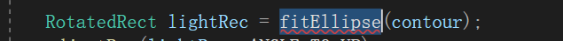

## 装甲板检测

### 一.预处理图像，由两方面因素来控制精度

灯条和外界环境的关系有如下两个方面：

+ 明确：例如“蓝色灯条”：会发光，有颜色！

1. 要识别出灯条，很明显的特征就是亮度，所以考虑转灰度图之后用`inRange`提取较亮的部分
2. 考虑到环境灯光也会产生较亮的灯从而产生干扰，那么第二个特征就是“蓝色”灯条的“蓝色”。由于外界自然光或灯光大多为白色，颜色比较平均，没有明显的蓝色和红色的偏差。

当然，两者得到的共同区域就是较准确的区域了，这里将两个二值图进行“&”位运算。

注意：两者缺一不可，少了2会导致环境亮光干扰，少了1会导致环境较暗的红色或蓝色干扰。

+ 最后膨胀两次可能是因为，灯条太亮导致中心为白光，然后其实位运算后的是外面的一环（具体还要看阈值的设置）


### 二.矩阵矫正adjustRect

+为顺时针，-为逆时针

两种mode：

1. `WIDTH_GREATER_THAN_HEIGHT`让长的边为width，短的边为height，while循环是为了控制夹角在-90°到90°之间
2. `ANGLE_TO_UP`表示不管长边还是短边，就看和x轴正方向夹角最小是多少度，以此作为矩阵的`angle`


### 三.轮廓处理

```cpp
	vector<vector<Point>> lightContours;
	cv::findContours(binBrightImg.clone(), lightContours, RETR_LIST, CHAIN_APPROX_SIMPLE);
```
`RETR_LIST`表示轮廓之间独立

`CHAIN_APPROX_SIMPLE`表示只储存轮廓的所有拐点，中间的连续点不管

接着for循环遍历轮廓：

```cpp
if (contour.size() <= 5 || lightContourArea < _param.light_min_area)
	continue;
RotatedRect lightRec = fitEllipse(contour);
adjustRec(lightRec, ANGLE_TO_UP);

if (lightRec.size.width / lightRec.size.height > _param.light_max_ratio || 
    lightContourArea / lightRec.size.area() < _param.light_contour_min_solidity)
	continue;
```

碰到拐点太少的或者轮廓面积太小的不要；

对轮廓进行椭圆拟合，因为后面要框出轮廓，但是轮廓是很难看、凹凸不平的，所以进行椭圆拟合，之后取椭圆的拟合矩形。

+ 这里将拟合后的外接矩阵使用`ANGLE_TO_UP`进行矫正

拟合后外接矩形长宽比太离谱的不要；

拟合后得到的外接矩阵大的离谱的不要；


灯条外接矩阵大小要进行一定程度的放缩

~~没看懂`srcBound`为啥是`Point(0, 0)`,不应该尽量往中间移嘛？~~

`srcBound`是设置整个图片的边界矩形，防止越界报错(？)，所以设置在`Point(0, 0)`,他不是ROI。

然后这里和灯条做了个位运算

把最初的外接矩阵的四个顶点赋值给`lightVertexArray`数组，不是位运算那个！！


注意，检测到的灯条基本上都是竖着的，所以这里能够用外接Rect矩形来进行框定

写了写试验的demo加深理解：


事实上，红色矩形在实战中不太可能出现，因为倾斜角度太大了！(或者说出现的时间非常短暂，可以忽略)

+ **其实这里本质上还是取了一个ROI啊！！最小的ROI就是它的外接Rect了！！**


```
lightImg &= srcBound;
//这句话是用一个srcBound设置边界，意思是我只考虑这个区域内出现的灯条
//如果灯条出现在这个区域外面，我就不管了
//但是前面的srcBound的设置我感到有点儿奇怪，为啥是选取Point(0, 0)呢？
//按理来说不应该检测偏中间的灯条吗，为什么不设置在图像的中间的位置？
```


这里的`lightImg`是原图中的ROI区域，这里`lightMask`作为掩膜


就是这个，作为掩膜，只对灯条部分进行平均进行mean函数运算

返回的是`Scalar(a, b, c)`

就是掩膜区域中所有的点的`Scalar(a, b, c)`的总和处以总点个数

（平均之后比较怪异，只能看到一种颜色，这种颜色是bgr的共同结果）

**更何况这个灯条就是一种颜色来着的，只要判断平均后是蓝色还是红色就ok了！**


### 四.灯条匹配


既然要匹配灯条，那肯定先要给灯条轮廓排序，按照从左到右排。

然后双重循环遍历灯条，查看每一对的匹配程度


+ 衡量匹配程度的两个尺标：

1. 两个灯条角度之差不能太大
2. 两个灯条的长度差值不能太大(这里做了归一化，因为长度比较是相对的)

这里我们要复习一下：灯条是怎么来的？



~~灯条是轮廓进行椭圆拟合之后，返回一个`RotatedRect`，从opencv的源码来看，他是保证这个`RotatedRect`是`heigh > width`的~~

~~根据opencv源码中的设计：~~

~~1. `RotatedRect lightRec = fitEllipse(contour)`返回的这个矩形，他一定是`height > width`的~~
~~2. 然后有两种调整的方式，一种是令`width > height`,另外一种是调整角度，让矩形的angle为较小的那个角。~~

~~+ 于是这里有个问题，`leftLight.length`和`rightLight.length`是长的那条边吗？？？？？为啥感觉不是呢？因为前面如果出发了调整角度，而且大概率会触发调整角度，那这个length不就是变成那条比较小的边了吗？(然后我写了一个demo，发现确实如此。)~~


(这里的数字是轮廓数，不需要管它emmm

重要的是看同一个`RotatedRect`，有些是没被矫正，意思是本来的角度就是好的，这个时候，由于椭圆拟合返回的`RotatedRect`是保证`height > width`的；但是有些角度长得不好的矩形，被矫正之后，`height`和`width`就交换了，就不满足天生的那个`height > width`。


然后下面是选用`WIDTH_GREATER_THAN_HEIGHT`


然后我们来看下面的过滤的代码：


它的俩标准：

1. 角度相差不能太大，这就是为`ANGLE_TO_UP`准备的！这种矫正方法保证了角度不会相差太大（但是话说回来，这个如果距离很近，那会不会变成“八”字型？而且“八”字型的情况下，两个灯条要是互补，那也是会导致angle相差不大的呀！）
2. 灯条长度不能太大，但是万一一个矫正了，一个没矫正，那他们的height相差岂不是非常的大了？？？

（但是有可能是我想多了，在2-3米的情况下其实实际效果比较好？**有没有什么方法可以让height是长的，而且角度基本保持一致呢？**）


然后接着还是对灯条的位置情况进行过滤筛选：


诸如y坐标不能太小啦（归一化）、两个灯条x坐标（水平距离）间距不能太小呀、俩灯条中心距离和灯条长度比值不能太大也不能太小啦（也就是装甲板的大小）

（能不能给限制条件都搞一个上界和下界？？）


#### 决策机制


这里是使用一个叫做`rotaionScore`的指标来计算一块装甲板容不容易被打到，具体计算是看装甲板大小（但是这里的参数将`armor_big_armor_ratio`设置成了2.5，`armor_small_armor_ratio`设置成了2.0，也就是说，如果ratio在2.0到2.5之间，识别出来是当作小装甲板，但是算指标的时候贡献值都一样是0）和y坐标的差值。


根据前面算得的装甲板长宽比`ratio`，判断装甲板大小，并且无论如何（**不管高分低分，只要匹配度够高，没有提前被continue就当作目标！！**）将其存入armor数组中备用，即为这一帧检测到的装甲板。

然后就将这俩灯条，还有相关参数特征传给armor装甲类的构造函数，存到armor数组中，等待后续备用。

最后是break内层循环，也就是找到与下标为i的灯条匹配的灯条了，于是提前退出，找第i+1个灯条的匹配灯条。

+ **双重循环结束后，_armor数组里面应该有这一帧图片中所有的匹配的灯条，他们一对对构成装甲板！！！**

**换句话说，如果没有匹配的灯条，那么_armor数组就是空的**

于是有了下面：


如果这一帧图片中没有找到匹配的灯条，那么就看前面几帧图片的情况：

1. 前面几帧图片有匹配的灯条（即`ARMOR_LOCAL`状态）：那我再给你五帧机会，如果后面五帧都没有匹配灯条，那我就把你“拉入黑名单”了，也就是把你的状态该成`ARMOR_LOST`，而且不往那个地方自动打击了！把目标装甲的位置清空。
2. 前面好多帧图片都没有匹配，本来就是“黑名单”里面的人了，就返回“没有检测到装甲”，当然也要把目标装甲清空。


##### 计算得分，哪个装甲板更加值得打？


选取分数最高的装甲板，最值得打击。

（_trackCnt++就是找到了说一声，打个招呼~）


最后的最后！历经千辛万苦，终于在这一帧有灯条经过层层筛选，成为可以击打的目标！！！

然后就把lost_cnt清零，并且当前状态加入“白名单”！即现在进入自动打击状态。


到这里，整个装甲板大类的主要内容差不多讲完了，下面是一些辅助功能的封装：

+ 返回目标装甲板的四个顶点

！值得一提的是，前面都是对一个ROI进行分析的，所以一通操作得到的装甲板位置都是相对于ROI的，这里就是把它变成“realVertex”，就是在整个图像中的坐标（就是坐标系转换）


+ 图片的载入和ROI区域的选定


这里的逻辑：（注意区别！！`_roi`是一个矩形Rect，而`_roiImg`是一个Mat）

```
如果目前状态是有打击目标
	_roi = 整个图片的矩形imgBound & 相对于整个图片左上角的装甲板外接矩形bRect的两倍
	将_targetArmor.vertex从相对ROI转换到相对整个图像
	选取src中的ROI区域，保存到_roiImg
如果目前状态是没有打击目标
	_roi复原，就是整个图片的边界矩形
	_roiImg就是整个图像了
```

+ 特别注意，在得到bRect之后，没有直接将整个图片界面和装甲板的矩阵进行&运算，而是用下面这个函数，以bRect中心为锚点放大成两倍。**因为我们每一帧的检测都是在ROI区域中进行的，如果不放大的话，敌方一移动，直接就跑出ROI区域了，那肯定不行啊 ！所以要放大成两倍的范围**

（为啥要&，不直接取bRect呢？可能是越界会报错？）

下面这个是放大成两倍的函数：


+ 如果没有打击目标，那么就将`_roi`和`_roiImg`还原


+ 装甲板描述的构造函数


但是，感觉这个点有点奇怪啊？这个装甲板的vertex，如下


+ 后面就是计算这个装甲板的得分，然后存到它的描述里面


（`grayImg`是ROI的灰度图）

ps:`corssPointOf`是拿到对角线的交点，`sightOffset`是装甲板中心和图像中心的距离，距离越小，得分越高。


+ 得到装甲的正面图(getFrontImg)


+ 俩无参构造函数，进行初始化：`ArmorDescriptor`和`ArmorDetector`


+ `ArmorDetector`有参构造


+ 初始化装甲板


### 五.分割出中间的数字（这里主要是判断装甲板中间有没有数字，有数字的话就是真的装甲板，不然的话就是转了九十度的假的装甲板）


注意这里的`reshape`：第一个参数是通道数（regulatedImg本来就是灰度图），第二个参数是row。由此我们可以知道，他是根据row自动计算col的！


是32位`float`单通道。

然后创建一个svm对象，把data丢给他进行预测：


+ 得到目标装甲的大小（类型）


+ 得到装甲板的中心点


+ 得到装甲板长度


 


