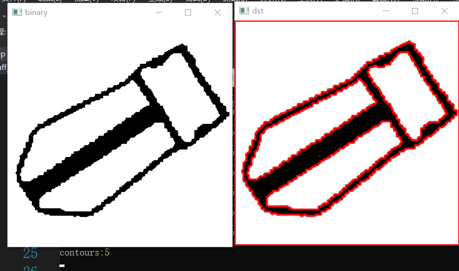

## 大风车识别

### 一.宏定义：识别方法？大小风车？


### 二.一些辅助的功能函数

+ 计算旋转角度


### 三.拟合圆（最小二乘法，就套公式硬算）


最后两行为拟合后的圆的中心坐标和圆半径（因为传入的是引用）

然后成功就返回`true`


### 四.二值化图像


将BGR图像二值化，有下面一些方法：（首先明确，gray_binary相当于亮度的二值图，有时要膨胀一下，因为中心太亮了的话被被搞掉）

1. **分通道法**：转GRAY，分三通道，红蓝通道相减，最后利用利用亮度作为掩模进行&运算（这个方法和armor_detect中的方法一样，就是检测“带颜色”的“亮的”灯条）

2. **颜色阈值分割法：**亮度图 & HSV颜色图（都是二值图）

3. **与绿通道相减法：**就是留下红色or蓝色，然后设定阈值进行二值化

4. **大津算法：**调用函数，这个算法可以自适应得出一个阈值（得到使得“前景”和“背景”方差最大的时候的阈值）

   ```cpp
   double test = threshold(gray, tempBinary, 0, 255, THRESH_OTSU);// 可以得出一个阈值
   ```

5. **YCrCb：**(常用于肤色检测？)

```cpp
Y = channels.at(0);//Y为明度
Cr = channels.at(1);//Cr为色调
Cb = channels.at(2);//饱和度
//Cb就是blue和green的色度。Cr就是red和green的色度。
```

[YCrCb相关资料](https://www.jianshu.com/p/cc64c8b88fbd)

6. **LUV：**

```cpp
//它的3个分量并不是都有物理意义。其中L是亮度，u和v是色度坐标。对于一般的图像，u*和v*的
//取值范围为-100到+100，亮度为0到100。
```

[LUV相关资料](https://blog.csdn.net/zhangping1987/article/details/73720664)


### 五.新版本：将已经打过的装甲板中心用在椭圆拟合上

+ 第一步就是用上面写好的得到“自己设定的方法得到的二值图”得到二值图binary，这个binary效果好的话就相当于**灯条为白色，其他为黑色**
+ 轮廓检测：树状结构存储，储存轮廓点


这里的for循环，是标记一些特定的轮廓**的父轮廓**，所谓特定，是指具有如下特征：

1. 这个轮廓有父轮廓（为啥里面还要写一遍父轮廓大于等于0？不是有父轮廓了嘛，感觉可以删了）
2. 这个轮廓的面积够大

如果有轮廓满足上述特征，那么就标记一下该轮廓的父轮廓。

是为了得到一个轮廓中的“一级子轮廓”个数？？？


这里很重要的知识：关于`findContours`

1. `findContours`得到的轮廓集合是自动会编号的，从0开始
2. 如果是树状结构存储轮廓，那么`hierarchy[i][0]`、`hierarchy[i][1]`、`hierarchy[i][2]`、`hierarchy[i][3]`**分别是：后、前、子、父的顺序**。

写一个demo体会一下：




课外小问题来了：**为啥检测轮廓的时候，他总是把最外面那个图像边框搞进去？**


+ 接下来就是选择检测锤子的方法：

要注意，上面的那几张图是“打完的风扇叶”

下面的才是我们的目标：待击打的风扇叶


经过预处理之后，他应该是个锤子样貌，于是就有了：

```
当某个轮廓的一级子轮廓个数为1时
	它就是锤子
	而且此时，它的子轮廓就是我们要找的目标装甲！
```


//debug部分代码


+ 上面是找**待打击的风扇**，下面是找到**已打击的的风扇的外轮廓**

这里就是把最外面的那个轮廓作为`FatherRect`，里面三个轮廓（？）作为`SonRect`


新方法是**打过的装甲板中心也用上，拿来拟合圆**

下面就是找三个子轮廓中的装甲板轮廓，这里采用的方法是通过长宽比来做选择，所以先存好所有子轮廓的长宽比（这里先是确保了长宽比大于1，不能直接根据长宽大小来判断，因为`RotatedRect`的长宽比很迷的呜呜呜呜呜呜）

然后对长宽比限制，找出正确的装甲板

值得一提的是：

1. 这里的`offset`s是ROI的误差。~~应该是各方面误差吧，应该是调参出来的（因为整个系统：视觉、电控、硬件、传感器，都是有误差的）~~
2. 这里`center_index`不能太多，意思是用来拟合圆的点不能太多，一定数量之后要清空。**一是计算量；二是，如果位置动了一下，那之前那些点就无效了，不能用来拟合圆！**

所以思路就是控制**用来拟合的点的个数**，这里是限制200，小于200个点就直接push；大于200个点，就从头开始覆盖（这里其实就是一个队列啦）


+ 最后的else，意思是：如果这个轮廓没有子轮廓，那么就下一个轮廓


ps：上面一堆操作就是为了找到**用来拟合圆的点**，存在`fan_armorCenters`

上面是新方法中，使用子轮廓的方法来找到装甲板中心的，下面则是使用`useLenet`的方法收集拟合用的点集


（啊艹？没写？）


如果用**找子轮廓**的方法没找到”hammer“(待击打的扇子)，直接return false，表示没有找到


如果找到了hammer，那么就不做这个if，而是继续往后执行，利用得到点集进行拟合圆（而且在这里可以预见地：最后要返回一个true表示检测到了目标）


上面是已经把这一帧图片中所有轮廓都检测出来了，同时得到一堆用于拟合的点集，个数不一定。

接下来就是：

**用收集到的200（或小于200）个点进行拟合，然后用这些点拟合出圆心、半径，圆心是取当前拟合的圆心，但是半径是取平均值，目的是更加稳定**，然后存到data中


后面是画出圆debug


### 六.用新版本方法detect

(留意一下这里的offset，ROI偏移为(0，0),没有偏移。看了一下offset的所有引用，没有改变过，感觉怪怪的？)


### 七.预测下一个坐标点


#### 1.对于小BUFF


#### 2.对于大BUFF

首先明白一些函数的含义：

+ 根据速度和官方提供的v-t表达式，可以反推出此时的t，也就是`nowTime`


可以知道`acos`返回的范围是`0`到`pi`


所以：`nowTime`的范围是从0开始的，一个周期之内（即0到3.3333）

+ 根据时间计算旋转角度


`time`是自己定义的时间间隔，`t`是表示当前时间，这里是通过定积分来求角度的


以下为大BUFF的处理方法：


上面是顺时针，下面是逆时针再来一遍，整体差不多


（**为啥我感觉这里没有必要搞1.6666和nowTime、Acceleration的关系的，因为它v-t函数图像始终是在x轴上方呀，放心积分就行了**）


+ 判断顺时针逆时针的小函数：`isClockwise`


这个好理解，就是看当前位置相对上一位置的关系判断转动方向


+ 得到加速度(就是代公式，求个导)


